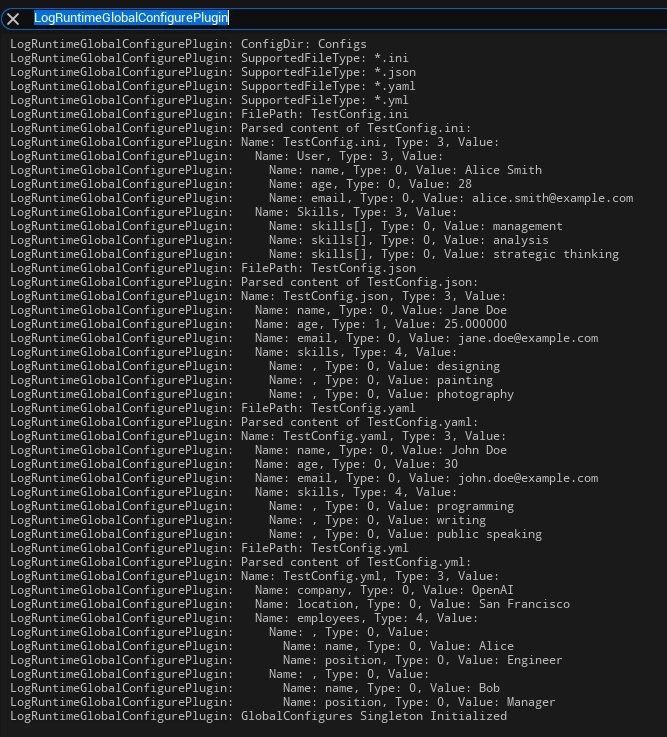

# RuntimeGlobalConfigure
 运行时可修改的全局游戏配置
# 插件介绍
 在开发过程中，有时会需要将一些设置放到程序外部文件。而虚幻提供的文件读取并没有形成模块体系。此插件旨在将配置文件封装为一个模块以便开发者使用。
### 食用指南
 启动插件后，默认情况下会在Content中生成一个Configs文件夹以存放配置文件，配置文件支持ini、json、yml、yaml格式，在程序启动后，会自动读取其中的配置文件。保存在单例类中，所有的配置以结构：FConfigNode存储为树状图，通过函数GetFirstLayerChildNames获取根配置节点，通过FindConfigNodeByPath获取具体的配置。
# 效果图
 遍历测试配置文件中的设置项
